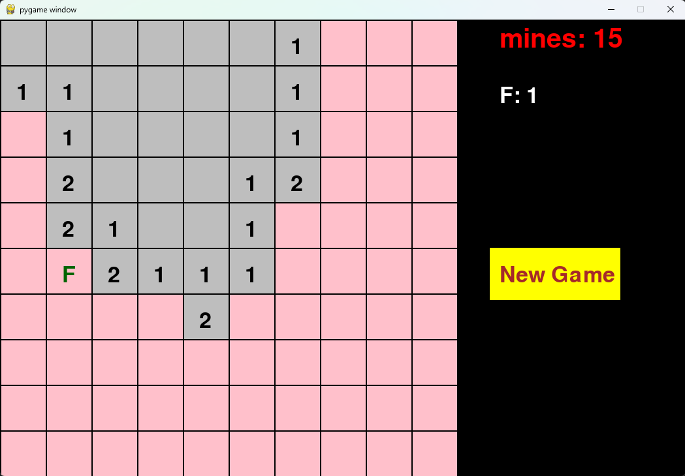
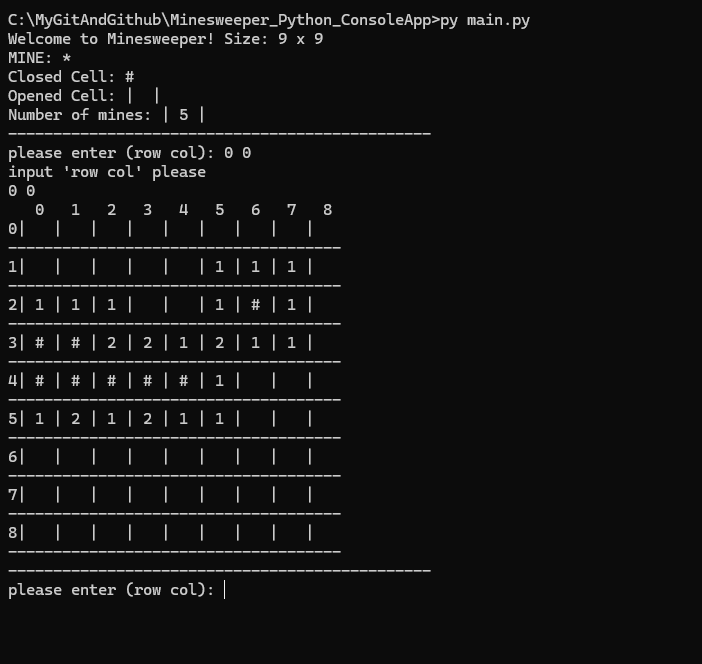

### Simple MineSweeper game clone!

#### Pygame:

    - Mines count = 15
    - F = Flag (press mouse 2 to place flag)
    - "New Game" = Create new game

#### Console MineSweeper:

    - Mines count = 5
    - Rows: 9
    - Cols: 9
    - MINE: * 
    - Closed Cell: # 
    - Opened Cell: |  | 

#### I have created MineSweeper using different programming languages.

    - C#: Using Visual Studio and Windows forms
    - JavaScript: Using html canvas, JavaScript and bit of css
        - This version has more features than other versions
    - Python: Using PyGame